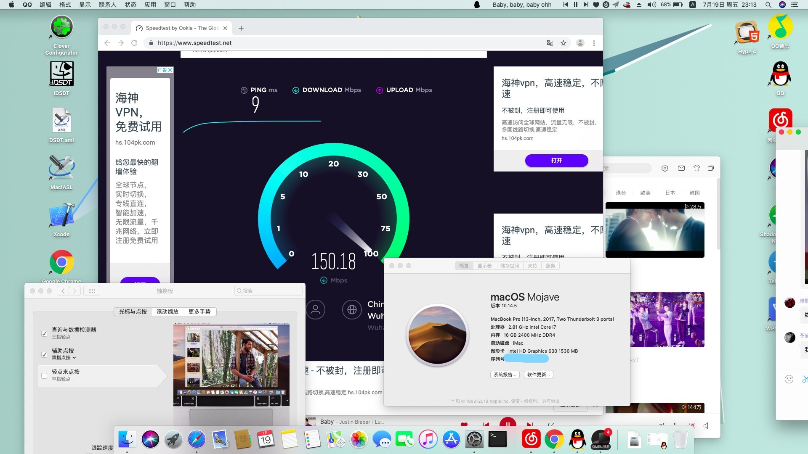

# OMEN by HP Laptop 15-ce0xx

### 😥此EFI可能存在某些问题，谨慎使用

<a href="https://github.com/bessyjl/HP-OMEN-3-Hackintosh">English</a>|中文(当前)

### 配置

| 产品名称暗影精灵3 | OMEN by HP Laptop 15-ce0xx                |
| ----------------- | ----------------------------------------- |
| BIOS              | F.19-04/18/2019                           |
| 处理器            | Intel(R) Core(TM) i7-7700HQ CPU @ 2.80GHz |
| 独立显卡          | NVIDIA GeForce GTX 1050                   |
| 显卡              | Intel(R) HD Graphics 630                  |
| 声卡              | ALC295                                    |
| 硬盘              | HP SSD EX950 512G、HGST 1T                |

### 已经OJBK的，和一些说明

- 声卡驱动正常，没发现破音
- 配置页面显示正常
- 所有功能正常使用，无报错，包括APP Store、~~Facetime~~、iTunes等
- 触摸板、电池均正常
- 休眠正常
- ~~蓝牙没用过，不知道。。。~~
- 机器上~~所有接口~~均正常，除了type-c接口没试过，我没有配件用的上这个接口
- 有线网卡正常，无线网卡无解
- 原生电源驱动正常，电池显示打了补丁
- 完美实现不插电开机(暗影精灵最难解决的就是这个！)
- USB限制，不知道是解除了还是压根就没有，[远景有篇帖子可以看看](http://bbs.pcbeta.com/viewthread-1804129-1-1.html)
- 等等，不一一列举了！

### 无效功能

- ~~小太阳(亮度调节)正常，打了补丁~~,在10.13.6可以调节，在10.14.5需要单独重新弄。
- FaceTime在10.13.6及一下，都能激活使用，并和我的同学的iphone通话，但10.14.5不行，我还在查找原因！
- 蓝牙需要单独激活(反正我几乎是没用过笔记本电脑的蓝牙，所以我想偷懒！)
- type-c应该是用不了。
- 由于总所周知的原因，无线网卡无法驱动，只能靠USB网卡、有线网络或者换一个网卡来解决，如:Broadcom BCM94352z
- 键盘暂时无法调节亮度，等啥时候有空再去管它吧！
- 独显是没法驱动滴，这个大家都知道！
- 由于独显没法驱动，所以HDMI无法使用！应该有其它解决方案的。
- 其它问题暂时没发现，或者没注意到，毕竟每个人的使用程度不一样，我的要求就是能简单的娱乐办公就行了！

### 一些参考教程

[黑苹果教程](http://www.zhuimeng.online/clover.html)

[HP暗影精灵3安装 macOS 10.14.3 Mojave 记录](https://mp.weixin.qq.com/s/oPAwyR9WafBcg0N-raPWYw)

[macOS Mojave黑苹果教程！](https://mp.weixin.qq.com/s/st7feN-yHfDcvCEngvbIEw)

[【黑果小兵】macOS Mojave 10.14.5 18F132 正式版 with Clover 4928原版镜像](https://blog.daliansky.net/macOS-Mojave-10.14.5-18F132-official-version-with-Clover-4928-original-image.html)

远景论坛[修改dsdt实现电量显示方法（整理修改已有帖子）](http://bbs.pcbeta.com/viewthread-1778499-1-1.html)

tonymacx86[HP OMEN 15-dc电池错误](https://www.tonymacx86.com/threads/solved-hp-omen-15-dc-battery-error.263814/#post-1841023)

[[指南]如何修补DSDT的工作电池状态](https://www.tonymacx86.com/threads/guide-how-to-patch-dsdt-for-working-battery-status.116102/)

### 安装完之后可以干些什么？

远景论坛[黑苹果洗白成功分享](http://bbs.pcbeta.com/viewthread-1798846-1-1.html)

[**macOS- 安全和隐私指南**](https://github.com/drduh/macOS-Security-and-Privacy-Guide)

### 下载链接 镜像同步上传中

👍**镜像来自于@黑果小兵的博客找的链接，我自己用的也是这个镜像！**

迅雷离线下载：[[请点击下载](https://mirrors.dtops.cc/iso/MacOS/daliansky_macos/macOS Mojave 10.14.5(18F132) Installer with Clover 4928.dmg)] 感谢`@难忘情怀`提供下载资源

http下载链接:[请点击下载](https://mirrors.dtops.cc/iso/MacOS/daliansky_macos/) 感谢`@难忘情怀`提供下载资源

百毒云：链接: <https://pan.baidu.com/s/1AKuzJXJe7haNYWo00YwJlQ> 提取码: ivmi

MD5 (macOS Mojave 10.14.5(18F132) Installer with Clover 4928.dmg) = 371d9145484beaf0795d6b7d0d569fc3

### 致谢

- 感谢 [Acidanthera](https://github.com/acidanthera) 提供 [AppleALC](https://github.com/acidanthera/AppleALC)，[HibernationFixup](https://github.com/acidanthera/HibernationFixup)，[Lilu](https://github.com/acidanthera/Lilu)，[OpenCorePkg](https://github.com/acidanthera/OpenCorePkg)，[VirtualSMC](https://github.com/acidanthera/VirtualSMC)，[VoodooPS2](https://github.com/acidanthera/VoodooPS2) 和 [WhateverGreen](https://github.com/acidanthera/WhateverGreen)。
- 感谢 [alexandred](https://github.com/alexandred) 提供 [VoodooI2C](https://github.com/alexandred/VoodooI2C)。
- 感谢 [apianti](https://sourceforge.net/u/apianti)，[blackosx](https://sourceforge.net/u/blackosx)，[blusseau](https://sourceforge.net/u/blusseau)，[dmazar](https://sourceforge.net/u/dmazar) 和 [slice2009](https://sourceforge.net/u/slice2009) 提供 [Clover](https://sourceforge.net/projects/cloverefiboot)。
- 感谢 [RehabMan](https://github.com/RehabMan) 提供 [EAPD-Codec-Commander](https://github.com/RehabMan/EAPD-Codec-Commander)，[OS-X-Clover-Laptop-Config](https://github.com/RehabMan/OS-X-Clover-Laptop-Config)，[OS-X-Null-Ethernet](https://github.com/RehabMan/OS-X-Null-Ethernet)，[OS-X-USB-Inject-All](https://github.com/RehabMan/OS-X-USB-Inject-All) 和 [SATA-unsupported](https://github.com/RehabMan/hack-tools/tree/master/kexts/SATA-unsupported.kext)。
- 感谢远景论坛的各位大佬提供的教程，以及[黑果小兵](https://github.com/daliansky)的镜像。

### 常见问题

**Q:如何进入BIOS或者设置启动项？**

A:开机后按下ESC键，然后根据指引选择

**Q:是否需要登录apple账号呢？**

A:建议使用小号来登录，否则可能被apple拉黑！

**Q:为什么在你的电脑上可以，而我的电脑上不行呢？**

A:我也不知道，您可以尝试问一下你的电脑:为什么你不行？

**Q:为什么这么费电？**

A:Google搜索:如何禁用独立显卡以节省电量

**Q:为什么没有HiDPI？**

A:我并不能解决所有的问题，如果您能向我提供帮助，那么太感激您了！

### 🔊扬声器无法使用的解决方案

暗影精灵3的声卡是ALC295，找到我在repo中提供的`VoodooHDA-295.pkg`，并安装它。我很懒，只提供了这一种方案，如果您有更好的方案，欢迎分享！

### 😘提供动力

| 微信                               | 支付宝                           |
| ---------------------------------- | -------------------------------- |
|  |  |

PayPal:https://www.paypal.me/bessyjl

### 联系我

Email:631908942#qq.com

微信公众号：爪哇派生